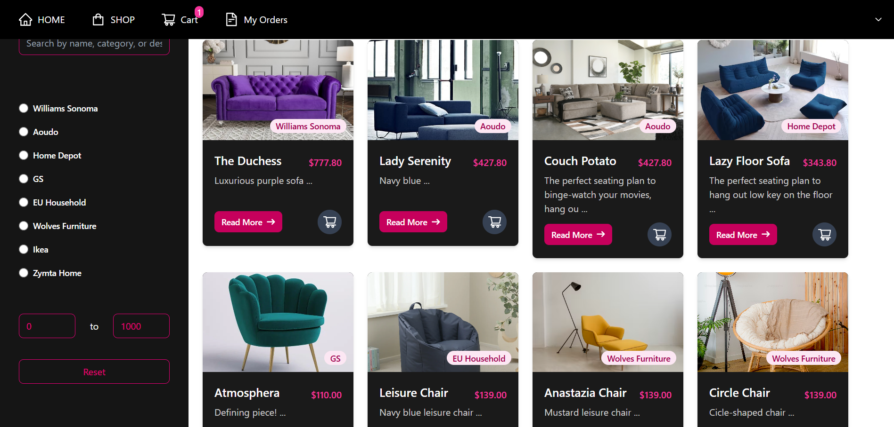

🛋️ Ecommerce Furniture

This is a MERN Stack Ecommerce Furniture Website that allows users to browse, filter, and purchase furniture items.

📸 Project Preview

🚀 Features

Beautiful UI with category & price filtering

Add to cart functionality

Responsive design

Dynamic product listings

📂 Project Setup

1️⃣ Clone the repository

git clone https://github.com/DianaFarhat/Ecommerce-Furniture.git
cd Ecommerce-Furniture

2️⃣ Install dependencies

Backend:

cd backend
npm install
npm start

Frontend:

cd frontend
npm install
npm start

🌐 Running the Project

The backend will start on http://localhost:3000

The frontend will start on http://localhost:3001

🎉 Now, you can explore the ecommerce platform!

